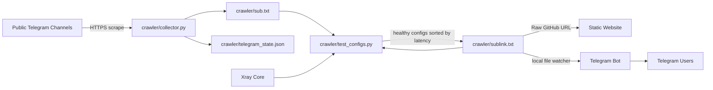

# V2ray_crawler
# on bir VPN — V2Ray Crawler


Automatically collect proxy configurations from public Telegram channels, validate them with Xray, publish a subscription file, and distribute the results through a static website and a Telegram bot.

> [!IMPORTANT]
> This project is provided for educational, research, and lawful use. You are responsible for complying with local laws, service-provider terms, and server-access permissions.

## Table of contents

- [Overview](#overview)
- [Features](#features)
- [Architecture and data flow](#architecture-and-data-flow)
- [Repository structure](#repository-structure)
- [Supported protocols](#supported-protocols)
- [Prerequisites](#prerequisites)
- [Installation](#installation)
- [Configuration](#configuration)
- [Running the complete pipeline](#running-the-complete-pipeline)
- [Running the website](#running-the-website)
- [Running the Telegram bot](#running-the-telegram-bot)
- [Production deployment](#production-deployment)
- [Output and state files](#output-and-state-files)
- [Security](#security)
- [Current limitations](#current-limitations)
- [Troubleshooting](#troubleshooting)
- [Validation and development](#validation-and-development)
- [Contributing](#contributing)
- [License](#license)

## Overview

This repository consists of four primary components:

1. **Collector**: Reads public Telegram channel messages through `t.me/s/...` and extracts proxy URIs.
2. **Config Tester**: Converts each URI into an Xray configuration, tests real connectivity through a local SOCKS proxy, measures latency, detects the exit country, and keeps only working configurations.
3. **Static Website**: Fetches the final output from GitHub and provides configuration browsing, country filtering, one-click copying, and a location map.
4. **Telegram Bot**: Delivers working configurations to users and watches the local subscription file for changes so it can broadcast update notifications.

The main public output of the project is:

```text
crawler/sublink.txt
```

Raw URL for the file on the `main` branch:

```text
https://raw.githubusercontent.com/aghrabooti/V2ray_crawler/refs/heads/main/crawler/sublink.txt
```

## Features

- Collects configurations from public Telegram channels without logging in to Telegram
- Stores the last processed message ID for incremental crawling
- Removes duplicate configurations
- Limits collector output to prevent uncontrolled growth
- Converts multiple URI formats into Xray-compatible outbounds
- Validates generated configurations with `xray run -test`
- Runs an isolated Xray process for each configuration
- Tests real connectivity through a local SOCKS proxy
- Measures connection latency
- Detects the exit IP address and country
- Sorts healthy configurations by latency
- Adds a country flag, project name, and date to each URI fragment
- Automatically removes failed configurations from the final subscription
- Includes a responsive static website with no application backend
- Filters configurations by country
- Displays countries and configuration counts on an interactive map
- Copies complete configuration URIs to the clipboard
- Includes a Telegram bot with an inline configuration menu
- Stores bot users and broadcasts subscription update notifications

## Architecture and data flow



### Stage 1: Collection

`crawler/collector.py` checks the channels listed in `CHANNELS`, identifies new messages by consulting `telegram_state.json`, and writes up to `MAX_CONFIGS` unique configurations to `sub.txt`.

> In the current implementation, `sub.txt` is overwritten with the output of the latest collector run. Previously working configurations are retained during the tester stage through `sublink.txt`.

### Stage 2: Testing and filtering

`crawler/test_configs.py` combines `sub.txt` with the previous `sublink.txt`, removes URI fragments before comparison, and tests every unique configuration sequentially:

1. Parse the configuration URI
2. Generate a temporary Xray configuration
3. Validate the generated configuration
4. Start Xray with a local SOCKS inbound
5. Send a test request through the tunnel
6. Retrieve the exit country and IP address
7. Sort working configurations by latency
8. Rewrite `sublink.txt` with working configurations only

### Stage 3: Distribution

- The website reads `crawler/sublink.txt` from the repository's `main` branch through Raw GitHub.
- The Telegram bot reads the local `crawler/sublink.txt` and checks it for changes every 30 seconds.

## Repository structure

```text
V2ray_crawler/
├── .github/
│   └── workflows/
│       ├── main.yml             # Not a valid workflow in its current state
│       └── update.yml           # Disabled, fully commented workflow draft
├── bot/
│   ├── .env                     # Bot token; must not be stored in Git
│   ├── bot.py                   # Bot menus, polling, and file watcher
│   └── users.JSON               # Existing user data; filename differs from code
├── crawler/
│   ├── collector.py             # Collects from Telegram public previews
│   ├── test_configs.py          # Tests with Xray and creates the subscription
│   ├── sub.txt                  # Raw collector output
│   ├── sublink.txt              # Final working subscription output
│   ├── telegram_state.json      # Last processed message ID per channel
│   ├── channels.txt             # Auxiliary snapshot; unused by the current pipeline
│   ├── configs.JSON             # Auxiliary snapshot
│   ├── v2ray_configs.txt        # Auxiliary snapshot
│   └── 1.txt                    # Auxiliary snapshot
├── webpage/
│   ├── assets/
│   │   ├── on-bir-vpn-logo.svg  # Primary editable logo
│   │   ├── on-bir-vpn-logo.png  # PNG logo
│   │   ├── on-bir-vpn-icon.svg  # Primary icon and favicon
│   │   └── on-bir-vpn-icon.png  # PNG icon
│   ├── index.html               # Static user interface
│   ├── script.js                # Fetching, filtering, copying, and map logic
│   └── countries.js             # Country names, flags, and coordinates
├── requirements.txt             # A partial list of Python dependencies
├── package-lock.json            # No active Node package pipeline at present
├── session.session              # Sensitive legacy session; must not be in Git
└── README.md
```

The auxiliary snapshot files are not required by the current collector → tester → publisher path unless they are connected to the code again in future development.

## Supported protocols

| Protocol | Collected | Tested by Xray tester | Recognized by website |
|---|:---:|:---:|:---:|
| VLESS | Yes | Yes | Yes |
| VMess | Yes | Yes | Yes |
| Trojan | Yes | Yes | Yes |
| Shadowsocks (`ss://`) | Yes | Yes | Yes |
| ShadowsocksR (`ssr://`) | No | No | Type label only |

Whether a particular configuration works also depends on its transport and options. The current parser covers common TCP, WebSocket, gRPC, and HTTP/2 paths for the relevant protocols and handles TLS and REALITY for VLESS.

## Prerequisites

### General requirements

- Git
- Python 3.10 or newer
- HTTPS access to Telegram, GitHub, and the configured test endpoints

### Config tester requirements

- [Xray Core](https://github.com/XTLS/Xray-core/releases)
- An available local port for SOCKS; the default is `10808`
- SOCKS support for Requests through `requests[socks]` or `PySocks`

### Website requirements

- A modern web browser
- A static file server for local development
- Access to Tailwind CDN, unpkg, Raw GitHub, FlagCDN, and CARTO

### Telegram bot requirements

- A bot token created with [BotFather](https://t.me/BotFather)
- An always-on environment suitable for long polling
- `pyTelegramBotAPI` and `python-dotenv`

## Installation

### 1. Clone the repository

```bash
git clone https://github.com/aghrabooti/V2ray_crawler.git
cd V2ray_crawler
```

### 2. Create a virtual environment

Linux or macOS:

```bash
python3 -m venv .venv
source .venv/bin/activate
```

Windows PowerShell:

```powershell
py -m venv .venv
.\.venv\Scripts\Activate.ps1
```

### 3. Install dependencies

```bash
python -m pip install --upgrade pip
pip install -r requirements.txt
```

The current `requirements.txt` does not include every package required by the code. Install these additional dependencies for the tester and bot:

```bash
pip install "requests[socks]" pyTelegramBotAPI python-dotenv
```

> `bot/bot.py` imports `telebot`, which is provided by `pyTelegramBotAPI`. The `python-telegram-bot` package currently listed in `requirements.txt` is not a replacement for it.

## Configuration

### Collector settings

The main collector settings are located at the beginning of `crawler/collector.py`:

```python
CHANNELS = ["DailyV2Proxy"]
MAX_CONFIGS = 100
OUTPUT_FILE = "sub.txt"
STATE_FILE = "telegram_state.json"
REQUEST_TIMEOUT = 15
```

- Channel names may be entered with or without `@`.
- Only public channels with an accessible web preview can be collected.
- `OUTPUT_FILE` and `STATE_FILE` are resolved relative to the current working directory, so run the collector from the `crawler` directory.

To process older messages again, first back up `crawler/telegram_state.json`, then lower the stored message ID for the relevant channel or recreate the state file.

### Config tester settings

Important settings are located at the beginning of `crawler/test_configs.py`:

```python
SUB_FILE = "sub.txt"
SUBLINK_FILE = "sublink.txt"
XRAY_BINARY = r"C:\path\to\xray.exe"
SOCKS_HOST = "127.0.0.1"
SOCKS_PORT = 10808
START_TIMEOUT = 5
TEST_TIMEOUT = 8
TEST_URL = "https://www.google.com"
GEOIP_URL = "http://ip-api.com/json/?fields=status,country,countryCode,query"
CONFIG_NAME = "on bir mehmet buyuk"
```

Before running the tester, replace `XRAY_BINARY` with the actual Xray executable path on your system.

Linux example:

```python
XRAY_BINARY = "/usr/local/bin/xray"
```

Windows example:

```python
XRAY_BINARY = r"C:\Tools\Xray\xray.exe"
```

Notes:

- `SOCKS_PORT` must be available.
- The tester resolves its data files relative to the working directory, so run it from `crawler`.
- The endpoint configured in `TEST_URL` must be accessible through the tested tunnel.
- If GeoIP lookup fails, a working configuration may be saved without a country flag. The current website may then hide that configuration.

### Telegram bot settings

The local `bot/.env` file must contain:

```dotenv
BOT_TOKEN=YOUR_TELEGRAM_BOT_TOKEN
```

Never commit real values. Use an empty `.env.example` template to document required variables safely.

Notable hardcoded settings in `bot/bot.py`:

- Subscription path: `crawler/sublink.txt`
- Runtime user path: `bot/users.json`
- Subscription button URL: `https://qrco.de/bgy6Bk`
- File-check interval: 30 seconds
- Polling timeouts: 30 seconds

### Website settings

The data source is defined at the beginning of `webpage/script.js`:

```javascript
const SUBLINK_URL = "https://raw.githubusercontent.com/aghrabooti/V2ray_crawler/refs/heads/main/crawler/sublink.txt";
```

Country metadata is stored in `webpage/countries.js`. If a flag found in a configuration URI is not present in this table, the current interface removes that configuration from the displayed list.

## Running the complete pipeline

Run both collector and tester commands from the `crawler` directory:

```bash
cd crawler
python collector.py
python test_configs.py
```

Output flow:

```text
Telegram channels
  -> sub.txt
  -> Xray validation and connectivity test
  -> sublink.txt
```

After the tester finishes successfully, `sublink.txt` contains only configurations considered healthy during the latest run, sorted by latency.

> Tests run sequentially. Total execution time is approximately the sum of the connection time or timeout for every configuration.

## Running the website

Opening `index.html` directly through `file://` may trigger fetch or Clipboard API restrictions. Use a local HTTP server instead.

From the repository root:

```bash
python -m http.server 8000
```

Then open:

```text
http://localhost:8000/webpage/
```

By default, the website fetches data from the repository's `main` branch even when running locally. To test the local `crawler/sublink.txt`, temporarily change `SUBLINK_URL` to:

```javascript
const SUBLINK_URL = "../crawler/sublink.txt";
```

Restore the production URL before committing that development-only change.

## Running the Telegram bot

After installing the required packages and configuring `BOT_TOKEN`:

```bash
python bot/bot.py
```

Bot behavior:

- `/start` registers the user and displays the main menu.
- The `Configs` button builds a list from the current `crawler/sublink.txt`.
- Selecting an item sends the complete configuration URI.
- A watcher checks the subscription file every 30 seconds.
- When the file changes, an update notification is sent to registered users.
- Users who blocked the bot or are otherwise unavailable are removed when the relevant error can be identified.

The bot uses long polling and is not suitable for serverless platforms or services that regularly suspend processes.

## Production deployment

### Static website

Publish this directory:

```text
webpage/
```

It can be deployed to Vercel, Netlify, Cloudflare Pages, GitHub Pages, or any other static hosting provider.

Suggested Vercel settings:

| Setting | Value |
|---|---|
| Root Directory | `webpage` |
| Framework Preset | Other |
| Build Command | Empty |
| Output Directory | `.` |

Because the website reads the raw file from the `main` branch, the repository must be public unless the data source is replaced with an authenticated API or proxy.

### Telegram bot service

The bot requires a persistent process. Example systemd unit:

```ini
[Unit]
Description=on bir VPN Telegram Bot
After=network-online.target
Wants=network-online.target

[Service]
Type=simple
User=YOUR_USER
WorkingDirectory=/opt/V2ray_crawler
ExecStart=/opt/V2ray_crawler/.venv/bin/python bot/bot.py
Restart=always
RestartSec=5

[Install]
WantedBy=multi-user.target
```

After saving it as `/etc/systemd/system/onbir-bot.service`:

```bash
sudo systemctl daemon-reload
sudo systemctl enable --now onbir-bot
sudo systemctl status onbir-bot
```

### Scheduling the collector and tester

The pipeline can be scheduled with cron on the same system where the bot can access the resulting file. Example schedule for every six hours:

```cron
0 */6 * * * cd /opt/V2ray_crawler/crawler && /opt/V2ray_crawler/.venv/bin/python collector.py && /opt/V2ray_crawler/.venv/bin/python test_configs.py >> /var/log/onbir-pipeline.log 2>&1
```

Prevent multiple tester instances from running concurrently because they share the same SOCKS port and output file.

### GitHub Actions

GitHub automation is not active in the current repository state:

- `.github/workflows/update.yml` is fully commented out.
- `.github/workflows/main.yml` does not contain a valid workflow definition.
- The example paths in `update.yml` do not match the current script locations.

Until the workflow is rewritten and tested, updates must be performed locally or on a persistent server.

## Output and state files

| File | Producer | Purpose | Store in Git? |
|---|---|---|:---:|
| `crawler/sub.txt` | Collector | Raw configurations from the latest crawl | Optional |
| `crawler/sublink.txt` | Tester | Working configurations sorted by latency | Yes, for a public subscription |
| `crawler/telegram_state.json` | Collector | Last processed message ID | Depends on deployment strategy |
| `bot/users.json` | Bot | Runtime user identifiers | No |
| `bot/.env` | System administrator | Bot token | Never |
| `*.session` | Telegram client | Authentication session | Never |

## Security

> [!CAUTION]
> Bot tokens, Telegram sessions, and user identifiers are sensitive. Exposing them in a public repository may allow bot takeover, unauthorized account access, or user-data disclosure.

Required precautions:

1. If a token or session has ever been committed or pushed, **revoke or rotate it immediately**. Deleting the file in a newer commit is not sufficient.
2. Remove sensitive files from Git tracking and, when necessary, from the complete repository history.
3. Add an appropriate `.gitignore`.
4. Use the hosting provider's environment variables or secret manager in production.
5. Restrict filesystem permissions for runtime data.
6. Do not commit logs that may contain proxy URIs, chat IDs, or sensitive error details.

Suggested `.gitignore`:

```gitignore
.venv/
__pycache__/
*.py[cod]
.env
bot/.env
bot/users.json
bot/users.JSON
*.session
.DS_Store
```

## Current limitations

These items describe the current codebase rather than planned behavior:

1. **Incomplete dependencies**: `requirements.txt` does not include `pyTelegramBotAPI`, `python-dotenv`, or SOCKS support for Requests.
2. **Hardcoded Xray path**: `XRAY_BINARY` points to a specific Windows path and must be changed before use.
3. **User filename case mismatch**: The bot opens `bot/users.json`, while the tracked file is `bot/users.JSON`. This difference matters on Linux and other case-sensitive filesystems.
4. **Configurations without flags are hidden**: The website derives countries only from flag emojis in URI fragments and hides configurations without a recognized country.
5. **Multiple external website dependencies**: Failures involving Tailwind, Leaflet, Raw GitHub, FlagCDN, or CARTO may affect styling, mapping, or the configuration list.
6. **Tailwind Play CDN**: The current approach is intended for development. Production should use built and self-hosted CSS.
7. **Missing map attribution**: The attribution control is disabled and should be restored according to OpenStreetMap and CARTO terms.
8. **Placeholder links**: GitHub and Telegram links in the current HTML still use `href="#"`.
9. **Shared map and list error handling**: A Leaflet failure can replace an otherwise valid configuration list with an error message.
10. **No clipboard fallback**: Clipboard API failures are logged only to the browser console.
11. **Inactive automation**: No executable workflow currently performs scheduled updates.
12. **Old bot branding**: Some bot messages and logs still use the `ConfigHub` name.
13. **No automated test suite**: There are currently no unit tests, integration tests, or valid CI checks.

## Troubleshooting

### `ModuleNotFoundError: No module named 'telebot'`

```bash
pip install pyTelegramBotAPI
```

### `ModuleNotFoundError: No module named 'dotenv'`

```bash
pip install python-dotenv
```

### `Missing dependencies for SOCKS support`

```bash
pip install "requests[socks]"
```

### Xray cannot be found

Check `XRAY_BINARY` in `crawler/test_configs.py` and confirm that the file is executable:

```bash
chmod +x /path/to/xray
/path/to/xray version
```

### Port `10808` is already in use

Another process may be listening on the port. Stop that process or change `SOCKS_PORT`.

Linux:

```bash
ss -ltnp | grep 10808
```

Windows PowerShell:

```powershell
Get-NetTCPConnection -LocalPort 10808
```

### The collector finds no configurations

- Confirm that the channel is public.
- Open `https://t.me/s/CHANNEL_NAME` in a browser.
- Inspect `telegram_state.json`.
- Consider Telegram public-page HTML changes or network restrictions.

### Every configuration fails

- Check the Xray path and run `xray version` first.
- Confirm that the SOCKS port is available.
- Verify `TEST_URL` availability.
- Increase the configured timeouts.
- Confirm that the configuration transport is supported by the current parser.
- Review the error printed below each failed configuration.

### The website remains on `Loading configurations...`

Open the browser's Developer Tools and inspect Console and Network errors. Access to Raw GitHub and successful execution of `webpage/script.js` are required.

### The website shows fewer configurations than `sublink.txt`

The current interface displays only configurations whose URI fragments contain a valid flag and whose country exists in `webpage/countries.js`.

### The bot does not recognize existing users

On case-sensitive filesystems, `users.JSON` and `users.json` are different files. Align the runtime filename with `USERS_PATH` in the bot code.

## Validation and development

### Check Python syntax

```bash
python -m py_compile \
  crawler/collector.py \
  crawler/test_configs.py \
  bot/bot.py
```

### Check JavaScript syntax

```bash
node --check webpage/countries.js
node --check webpage/script.js
```

### Manual smoke test

1. Run the collector and inspect changes to `sub.txt`.
2. Run the tester with a small number of configurations.
3. Verify that entries in `sublink.txt` are valid URIs and include country flags when available.
4. Open the website through an HTTP server.
5. Test country filtering, the Copy button, and the map.
6. Test `/start`, configuration selection, and the watcher in the Telegram bot.

Running the tester connects to external endpoints and routes traffic through proxy servers. Run it only in an environment where you are authorized to do so.

## Contributing

Suggested contribution process:

1. Open an issue describing the bug or proposed feature.
2. Implement changes on a separate branch.
3. Never commit secrets, sessions, chat IDs, or runtime data.
4. Run the syntax checks listed above.
5. Provide safe, sanitized examples for parser changes.
6. Update this README and the limitations section whenever behavior changes.

Good priorities for future development include:

- Complete and pin all dependencies
- Move settings to environment variables or a configuration file
- Remove the hardcoded Xray path
- Add `.gitignore` and `.env.example`
- Sanitize repository history and rotate old credentials
- Add unit tests for URI parsers
- Add controlled integration tests for the pipeline
- Isolate website errors by component
- Build Tailwind locally and self-host production assets
- Add a valid and secure update workflow
- Store bot users in an appropriate database instead of local JSON

## License

This repository does not currently contain a `LICENSE` file. The absence of a license does not automatically grant permission to copy, modify, or redistribute the code. Choose and add an appropriate license—such as MIT, Apache-2.0, or GPL-3.0—before accepting public contributions or distributing the project broadly.